# Jarkom-Modul-1-2026-K-22

**Anggota Kelompok**
| Nama                   | NRP        |
| ---------------------- | ---------- |
| Muhamad Sabilil Haq    | 5027251041 |
| M. Faris Roisul Azhar    | 5027251048 |

## Laporan Praktikum

1. Menyiapkan router bernama `Lain` dan membuat 3 switch dari router tersebut. Switch pertama, terdapat dua entitas (client), yaitu `Alice` dan `Mika`. Switch kedua, membawahi satu entitas (server), yaitu `Chisa`. Terakhir, switch ketiga terdapat dua entitas (client), yaitu `Knights` dan `Eiri`.


Berikut merupakan konfigurasi dari kelima entitas tersebut. Disini, prefix IP dari kelompok kami adalah 192.222.X.X
  - Alice (switch 1)
```
auto eth0
iface eth0 inet static
    address 192.222.1.2
    netmask 255.255.255.0
    gateway 192.222.1.1
```
  - Mika (switch 1)
```
auto eth0
iface eth0 inet static
    address 192.222.1.3
    netmask 255.255.255.0
    gateway 192.222.1.1
```
  - Chisa (switch 2)
```
auto eth0
iface eth0 inet static
    address 192.222.2.2
    netmask 255.255.255.0
    gateway 192.222.2.1
```
  - Knights (switch 3)
```
auto eth0
iface eth0 inet static
    address 192.222.3.2
    netmask 255.255.255.0
    gateway 192.222.3.1
```
  - Eiri (switch 3)
```
auto eth0
iface eth0 inet static
    address 192.222.3.3
    netmask 255.255.255.0
    gateway 192.222.3.1
```
---

2. Pada saat itu, jaringan di The Wired masih terisolasi, sehingga dibutuhkan koneksi jaringan internet. Disini, kami menggunakan NAT yang dihubungkan dengan `Lain` (router) agar  dapat tersambung langsung ke jaringan internet publik. Kemudian, inilah konfigurasi dari routernya.
```
auto eth0
iface eth0 inet dhcp
```
test koneksi:


---

3. Di sisi lain, kita juga perlu menghubungkan kelima entitas, agar mereka bisa saling berinteraksi dan juga memastikan mereka terhubung dengan internet. Disini, peran `Lain` (router) adalah sebagai perantara yang menghubungkan kelima entitas tersebut. Untuk itu, terdapat beberapa tambahan pada konfigurasi `Lain`, sehingga konfigurasi `Lain` menjadi seperti ini.
```
auto eth0
iface eth0 inet dhcp

auto eth1
iface eth1 inet static
    address 192.222.1.1
    netmask 255.255.255.0

auto eth2
iface eth2 inet static
    address 192.222.2.1
    netmask 255.255.255.0

auto eth3
iface eth3 inet static
    address 192.222.3.1
    netmask 255.255.255.0
```

test keterhubungan kelima entitas
  - Alice to others
    


  - Mika to others
    


  - Chisa to others
    


  - Knights to others
    


  - Eiri to others
    


---

4. Agar kelima entitas dapat melakukan koneksi dengan internet. Ditambahkan lagi konfigurasi pada `Lain` berupa firewall/iptables (NAT Masquerade) dan juga kelima entitas tersebut diisi dengan DNS resolver (disini kami menjalankan script [fix_dns.sh](4/script%20yang%20ada%20di%20tiap%20entitas/fix_dns.sh) di kelima entitasnya).
  - Konfigurasi tambahan pada router `Lain`, sehingga konfigurasinya menjadi:
```
auto eth0
iface eth0 inet dhcp
    up sysctl -w net.ipv4.ip_forward=1
    up iptables -t nat -A POSTROUTING -o eth0 -j MASQUERADE

auto eth1
iface eth1 inet static
    address 192.222.1.1
    netmask 255.255.255.0

auto eth2
iface eth2 inet static
    address 192.222.2.1
    netmask 255.255.255.0

auto eth3
iface eth3 inet static
    address 192.222.3.1
    netmask 255.255.255.0
```
`up sysctl -w net.ipv4.ip_forward=1`: Mengaktifkan fitur IP Forwarding pada sistem operasi agar komputer/router diizinkan untuk meneruskan paket data dari jaringan lokal (LAN) menuju jaringan luar (Internet).

`up iptables -t nat -A POSTROUTING -o eth0 -j MASQUERADE`: Mengaktifkan NAT (Network Address Translation) dengan metode IP Masquerading untuk menyamarkan IP privat perangkat lokal menjadi IP publik milik kartu jaringan `eth0` saat mengakses internet.

  - test koneksi kelima entitas:
    
  
  
  

---

5. Untuk memastikan seluruh konfigurasi jaringan tidak hilang saat semua node di-restart, dibuatlah script [cek_status.sh](5/cek_status.sh) untuk mengeceknya. Cek hasilnya:


---

6. Mika mencurigai adanya anomali traffic pada segmen jaringannya. Untuk mengidentifikasi traffic tersebut, dijalankan [traffic generator](6/traffic_protocol7.sh) pada node `Mika`, kemudian dilakukan packet sniffing menggunakan Wireshark pada interface yang terhubung dengan `Mika`. Setelah proses capture berjalan, diterapkan display filter berikut:

    ```dns || icmp```

Filter tersebut digunakan untuk menampilkan paket yang menggunakan protokol **DNS** atau **ICMP** saja. Hasil packet capture setelah filter diterapkan adalah sebagai berikut.


Berdasarkan hasil capture, terdapat beberapa jenis traffic yang berhasil disaring oleh filter, yaitu:

- **ICMP**, berupa `Echo (ping) request` dan `Echo (ping) reply`. Traffic tersebut terlihat berasal dari `192.222.1.3` yang merupakan alamat IP node `Mika`, menuju `8.8.8.8` dan `1.1.1.1`, kemudian mendapatkan response kembali.
- **DNS**, berupa `Standard query` dan `Standard query response`. Terlihat adanya permintaan DNS dari `192.222.1.3` menuju `8.8.8.8` maupun `1.1.1.1` untuk melakukan resolusi beberapa domain, seperti `example.com`, `github.com`, `its.ac.id`, `google.com`, dan `cloudflare.com`.
- Pada bagian bawah Wireshark terlihat bahwa terdapat **51 paket yang berhasil ditangkap**, dengan **36 paket ditampilkan setelah filter diterapkan**, atau sekitar **70,6%** dari keseluruhan paket yang tertangkap.

Dengan demikian, display filter `dns || icmp` berhasil menyaring traffic sehingga hanya paket yang menggunakan protokol **DNS dan ICMP** yang ditampilkan. Hasil ini mempermudah pengamatan terhadap pola komunikasi DNS serta aktivitas ICMP pada node `Mika`.

---

7. Chisa memutuskan untuk mendirikan FTP Server dengan shared folder pada `/var/wired/data`. Konfigurasi dilakukan dengan membuat user `alice`, `mika`, dan `eiri`, kemudian menerapkan hak akses yang berbeda sesuai dengan ketentuan. Berdasarkan konfigurasi yang dibuat, `alice` memiliki hak akses **read & write**, `mika` memiliki hak akses **read-only**, sedangkan `eiri` dimasukkan ke dalam **FTP blacklist** sehingga tidak diperbolehkan mengakses FTP Server. :contentReference[oaicite:0]{index=0}

Pada node `Chisa`, terlebih dahulu dijalankan script [`setup_server.sh`](7/setup_server.sh) untuk menyiapkan FTP Server, shared folder, serta akun pengguna. Selanjutnya, script [`setup_ftp.sh`](7/setup_ftp.sh) dijalankan pada node yang membutuhkan FTP client. :contentReference[oaicite:1]{index=1}

Konfigurasi `vsftpd` menggunakan `/var/wired/data` sebagai `local_root` dan mengaktifkan akses pengguna lokal serta kemampuan menulis. Selain itu, digunakan konfigurasi `userlist` untuk membatasi akses user `eiri`. :contentReference[oaicite:2]{index=2}

### Pengujian user Alice

Untuk membuktikan bahwa user `alice` memiliki hak akses **read & write**, dilakukan koneksi FTP dari node `Alice` menuju FTP Server pada node `Chisa` menggunakan alamat IP `192.222.2.2`.


Setelah berhasil login sebagai user `alice`, dilakukan pengecekan isi direktori menggunakan perintah `ls`. Selanjutnya, file `signal_alice.txt` dibuat pada node `Alice` dan dikirim ke FTP Server menggunakan perintah `put signal_alice.txt`. Proses transfer berhasil dilakukan dan ditunjukkan dengan pesan `226 Transfer complete`.

Setelah proses upload selesai, dilakukan kembali pengecekan menggunakan `ls`. File `signal_alice.txt` terlihat pada direktori FTP Server dengan ukuran **16 bytes**, sehingga dapat dibuktikan bahwa user `alice` memiliki hak akses **write** pada shared folder tersebut.

### Pengujian user Eiri

Selanjutnya dilakukan pengujian menggunakan user `eiri` dari node `Eiri` untuk memastikan bahwa user tersebut tidak memiliki izin untuk mengakses FTP Server.


Saat mencoba melakukan koneksi ke FTP Server `192.222.2.2` menggunakan username `eiri`, server memberikan respons:

```text
530 Permission denied.
ftp: Login failed
```

---

8. Kelompok rahasia `Knights` perlu mengirimkan dokumen laporan intelijen ke FTP Server `Chisa`. Pada tahap ini, dilakukan koneksi FTP client dari node `Knights` menuju FTP Server `Chisa` menggunakan akun `alice`. Setelah berhasil login, file `knights_report.txt` diunggah ke server menggunakan perintah FTP `STOR`.


Berdasarkan hasil capture Wireshark, terlihat bahwa node `Knights` dengan alamat IP `192.222.3.2` mengirimkan perintah `STOR knights_report.txt` menuju FTP Server `Chisa` dengan alamat IP `192.222.2.2`. Perintah `STOR` digunakan oleh FTP untuk mengunggah atau menyimpan file ke server.

Selanjutnya, server memberikan respons dengan kode status `226`, yang menunjukkan bahwa proses transfer file telah berhasil diselesaikan.


Pada proses transfer, koneksi menggunakan mode passive. Dari hasil capture, terlihat negosiasi `EPSV` (Extended Passive Mode) dengan port data TCP `30056`. Port tersebut kemudian digunakan sebagai koneksi data untuk proses transfer file, sedangkan koneksi kontrol FTP tetap menggunakan port `21`.


Dengan demikian, hasil analisis sesi FTP adalah sebagai berikut:

- **Perintah upload:** `STOR knights_report.txt`
- **Kode status keberhasilan:** `226 Transfer complete`
- **Mode transfer:** Passive (`EPSV`)
- **Port data TCP:** `30056`
- **Port kontrol FTP:** `21`

Hasil capture menunjukkan bahwa proses upload file dari `Knights` ke `Chisa` berhasil dilakukan melalui FTP menggunakan akun `alice`.

---

9. Mika mengakses dokumen `protocol7_manifesto.txt` dari FTP Server `Chisa` menggunakan akun `mika`. Sebelum itu, lakukan dulu pengunduhan pada dokumen `protocol7_manifesto` tersebut menggunakan [download_kebutuhan_soal9.sh](9/download_kebutuhab_soal9.sh).


Selanjutnya, lakukan pengujuan.


Berdasarkan hasil pengujian, node `Mika` berhasil terhubung ke FTP Server Chisa pada alamat `192.222.2.2` menggunakan akun `mika`. Proses download dokumen `protocol7_manifesto.txt` berhasil dilakukan dengan perintah `get protocol7_manifesto.txt`, ditunjukkan dengan pesan `226 Transfer complete`.

Sedangkan, berdasarkan hasil pengujian, proses upload file `test.txt` tidak berhasil. FTP Server memberikan respons:

```text
229 Entering Extended Passive Mode (|||30032|)
550 Could not create file.
```

Respons dengan kode `550` menunjukkan bahwa server menolak operasi pembuatan atau penulisan file pada directory FTP. Hal ini membuktikan bahwa akun `mika` memiliki hak akses **read-only**. Akun `mika` dapat melakukan operasi pembacaan seperti `get`, tetapi tidak dapat melakukan operasi penulisan seperti `put`.

Dengan demikian, pembatasan akses akun `mika` pada FTP Server Chisa berhasil dibuktikan sebagai berikut:

- **Akun:** `mika`
- **Hak akses:** Read-only
- **Operasi download:** Berhasil menggunakan `get protocol7_manifesto.txt`
- **Status download:** `226 Transfer complete`
- **Operasi upload:** Gagal menggunakan `put test.txt`
- **Status upload:** `550 Could not create file`
- **Mode transfer:** Passive / `EPSV`
- **Port data TCP saat upload:** `30032`

---

10. Knights melancarkan uji ketahanan koneksi ke server `Chisa` untuk menguji latensi jaringan The Wired. Pengujian dilakukan dengan mengirimkan paket `ping` dari node `Knights` ke node `Chisa` dengan payload khusus 128 bytes, interval 0.3 detik, dan sebanyak 77 paket menggunakan perintah berikut:

```bash
ping -c 77 -s 128 -i 0.3 192.222.2.2
```


Berdasarkan hasil pengujian, node `Knights` dengan alamat IP `192.222.3.2` berhasil berkomunikasi dengan node `Chisa` pada alamat IP `192.222.2.2`. Seluruh paket yang dikirimkan mendapatkan respons dari server, sehingga tidak terjadi packet loss.

Hasil statistik `ping` menunjukkan:

- **Packets transmitted:** 77
- **Packets received:** 77
- **Packet loss:** 0%
- **RTT minimum:** 0.444 ms
- **RTT average:** 0.676 ms
- **RTT maximum:** 1.096 ms
- **RTT standard deviation:** 0.120 ms

Selanjutnya dilakukan analisis menggunakan Wireshark untuk melihat paket `ICMP Echo Request` dan `ICMP Echo Reply` yang dikirimkan antara node `Knights` dan `Chisa`.


Pada paket `ICMP Echo Request` yang dikirimkan dari `Knights` (`192.222.3.2`) menuju `Chisa` (`192.222.2.2`), diperoleh nilai:

- **ICMP Type:** `8` — Echo Request
- **ICMP Code:** `0`


Sementara itu, pada paket `ICMP Echo Reply` yang dikirimkan dari `Chisa` (`192.222.2.2`) menuju `Knights` (`192.222.3.2`), diperoleh nilai:

- **ICMP Type:** `0` — Echo Reply
- **ICMP Code:** `0`

Berdasarkan hasil capture Wireshark, setiap `Echo Request` dari `Knights` memperoleh `Echo Reply` dari `Chisa`. Hal tersebut sesuai dengan hasil pengujian `ping` yang menunjukkan **77 paket terkirim, 77 paket diterima, dan 0% packet loss**.

Nilai RTT berada pada rentang **0.444 ms hingga 1.096 ms**, dengan rata-rata **0.676 ms**. Dengan demikian, hasil pengujian menunjukkan bahwa koneksi antara `Knights` dan `Chisa` berhasil berjalan tanpa packet loss dengan RTT rata-rata sebesar **0.676 ms**.

---

11. Buktikan kelemahan protokol Telnet dengan membuat akun `phantom_user` dan password `wired_ghost` pada layanan Telnet di node `Chisa`. Disini, kami menggunakan script [`setup_akun_telnet.sh`](11/setup_akun_telnet.sh) untuk pembuatan akunnya. Selanjutnya, lakukan login Telnet dari node `Eiri` ke node `Chisa` dan lakukan capture menggunakan Wireshark untuk mengamati komunikasi yang terjadi.

Capture lalu dianalisis menggunakan Wireshark dengan fitur **Follow TCP Stream** untuk melihat isi komunikasi antara client dan server.


Berdasarkan hasil **Follow TCP Stream**, kredensial Telnet dapat terlihat secara langsung dalam bentuk **plain text**, yaitu username `phantom_user` dan password `wired_ghost`. Hal ini menunjukkan bahwa Telnet tidak menyediakan enkripsi terhadap data yang dikirimkan selama sesi berlangsung.

Kondisi tersebut terjadi karena Telnet merupakan protokol remote login yang mengirimkan data melalui koneksi TCP tanpa mekanisme encryption. Akibatnya, pihak yang dapat melakukan network sniffing terhadap lalu lintas jaringan berpotensi memperoleh informasi sensitif seperti username, password, serta perintah yang diketik oleh pengguna.

Pada hasil capture juga terlihat bahwa karakter yang diketik pada sesi Telnet dapat dikirim dalam paket TCP berukuran kecil dan sering kali satu karakter per segmen. Hal ini berkaitan dengan karakteristik Telnet yang bekerja secara **character-at-a-time**, yaitu input pengguna diproses dan dikirim segera setelah karakter diterima, bukan menunggu pengguna menekan `Enter` seperti pada aplikasi yang menggunakan line buffering.

Dengan demikian, ketika pengguna mengetik sebuah username atau password, setiap karakter dapat menghasilkan komunikasi TCP tersendiri. Namun, pemisahan satu karakter per paket bukan merupakan jaminan mutlak dari TCP karena segmentasi data tetap dapat dipengaruhi oleh buffering, TCP stack, dan kondisi jaringan.

Dari hasil pengujian dapat disimpulkan bahwa:

- **Protokol:** Telnet
- **Client:** `Eiri`
- **Server:** `Chisa`
- **Username:** `phantom_user`
- **Password:** `wired_ghost`
- **Kerahasiaan data:** Tidak terenkripsi / **plain text**
- **Analisis:** Kredensial dapat diperoleh melalui Wireshark menggunakan fitur **Follow TCP Stream**
- **Karakteristik pengiriman:** Telnet menggunakan mekanisme **character-at-a-time**, sehingga input dapat dikirim segera sebagai segmen TCP berukuran kecil.
- **Kelemahan utama:** Kredensial dan data sesi dapat disadap oleh pihak yang mampu menangkap traffic jaringan.

---

12. Alice mencurigai `Knights` menjalankan beberapa layanan rahasia pada node-nya. Lakukan pemindaian port dari node `Alice` ke node `Knights` menggunakan Netcat (`nc`) untuk memeriksa port `22` (SSH) dan `80` (HTTP) dalam keadaan terbuka, serta port rahasia `7777` dalam keadaan tertutup. untuk menyiapkan port yang akan di test, kami menjalankan script [setup_portscan_target.sh](12/setup_portscan_target.sh) di node Knights. Selanjutnya, dari node `Alice`, dilakukan pengecekan terhadap masing-masing port menggunakan Netcat:

```bash
nc -zv 192.222.3.2 22
nc -zv 192.222.3.2 80
nc -zv 192.222.3.2 7777
```

Hasil pengujian menunjukkan bahwa koneksi ke port `22` dan `80` berhasil, sedangkan koneksi ke port `7777` ditolak oleh server.


Selanjutnya dilakukan capture menggunakan Wireshark untuk menganalisis respons TCP dari masing-masing port. Filter yang digunakan adalah:

```text
ip.addr == 192.222.3.2 && (tcp.port == 22 || tcp.port == 80 || tcp.port == 7777)
```


Berdasarkan hasil capture Wireshark, terdapat perbedaan respons TCP ketika melakukan pengecekan pada port yang terbuka dan port yang tertutup.

Pada **port 22 (SSH)** dan **port 80 (HTTP)**, node `Alice` mengirimkan paket TCP `SYN` sebagai permintaan untuk membentuk koneksi. Karena terdapat layanan yang aktif pada kedua port tersebut, node `Knights` memberikan respons berupa `SYN, ACK`.

Alur komunikasi pada port terbuka adalah:

```text
Alice → Knights : SYN
Knights → Alice : SYN, ACK
Alice → Knights : ACK
```

Flag `SYN` menunjukkan permintaan untuk memulai koneksi TCP, sedangkan `ACK` menunjukkan acknowledgment terhadap paket yang diterima. Respons `SYN-ACK` menunjukkan bahwa port tersebut terbuka dan terdapat layanan yang menerima koneksi.

Sedangkan pada **port 7777**, node `Alice` tetap mengirimkan paket `SYN`, tetapi tidak terdapat layanan yang menerima koneksi pada port tersebut. Node `Knights` kemudian memberikan respons berupa `RST, ACK`.

Alur komunikasi pada port tertutup adalah:

```text
Alice → Knights : SYN
Knights → Alice : RST, ACK
```

Flag `RST` (`Reset`) digunakan untuk menghentikan atau menolak koneksi TCP yang tidak dapat dilanjutkan. Sementara itu, flag `ACK` menunjukkan acknowledgment terhadap paket `SYN` yang diterima.

Pada hasil pengujian port `7777`, respons `RST-ACK` terlihat pada Wireshark dan sesuai dengan pesan `Connection refused` yang ditampilkan oleh Netcat. Hal tersebut menunjukkan bahwa port `7777` berada dalam keadaan tertutup atau tidak memiliki layanan yang aktif.

Dengan demikian, hasil pengujian dapat dirangkum sebagai berikut:

| Port | Layanan | Status | Respons TCP | Keterangan |
|---|---|---|---|---|
| `22` | SSH | Terbuka | `SYN-ACK` | Terdapat layanan SSH yang aktif |
| `80` | HTTP | Terbuka | `SYN-ACK` | Terdapat layanan yang aktif pada port 80 |
| `7777` | Secret | Tertutup | `RST-ACK` | Tidak terdapat layanan yang menerima koneksi |

Berdasarkan hasil pengujian menggunakan Netcat dan analisis capture Wireshark, dapat diketahui bahwa **port terbuka merespons paket `SYN` dengan `SYN-ACK`**, sedangkan **port tertutup merespons dengan `RST-ACK`**. Perbedaan TCP Flag tersebut dapat digunakan untuk mengidentifikasi status port pada proses port scanning.

13. Lain memerintahkan agar administrasi jarak jauh menggunakan SSH secara aman tanpa password. Install OpenSSH server pada node Knights, buat pasangan kunci SSH (ssh-keygen) pada node Mika untuk user mika_admin, dan konfigurasikan public key authentication(PasswordAuthentication no). Lakukan koneksi SSH dari node Mika ke node Knights, tangkap sesi menggunakan Wireshark, identifikasi paket Protocol Version Exchange dan Key Exchange, serta jelaskan mengapa kredensial tidak terlihat dalam bentuk teks terbuka seperti pada Telnet.

Lain memerintahkan agar administrasi jarak jauh menggunakan SSH secara aman tanpa password. Pada tahap ini dilakukan konfigurasi SSH menggunakan metode public key authentication pada node Knights sebagai server dan node Mika sebagai client.

Pertama, dilakukan instalasi OpenSSH Server pada node Knights.

```
apt update
apt install openssh-server -y
```
Selanjutnya, pada node Mika dibuat pasangan kunci SSH menggunakan perintah ssh-keygen untuk user mika_admin.

``ssh-keygen``

lalu didapatkan public key dan private key

Kemudian public key dari node Mika dikirimkan menuju node Knights

`` ssh-copy-id mika_admin@[IP_Knights]``

Setelah itu dilakukan konfigurasi SSH Server agar tidak menerima login menggunakan password.

``nano /etc/ssh/sshd_config``

Tambahkan konfigurasi:
``
PasswordAuthentication no
PubkeyAuthentication yes
``
Restart service SSH:
``systemctl restart ssh``
Setelah konfigurasi selesai, dilakukan koneksi SSH dari node Mika menuju node Knights
``ssh mika_admin@[IP_Knights]``
Selanjutnya dilakukan capture menggunakan Wireshark untuk melihat proses komunikasi SSH.
filter yang digunakan:
``tcp.port == 22``

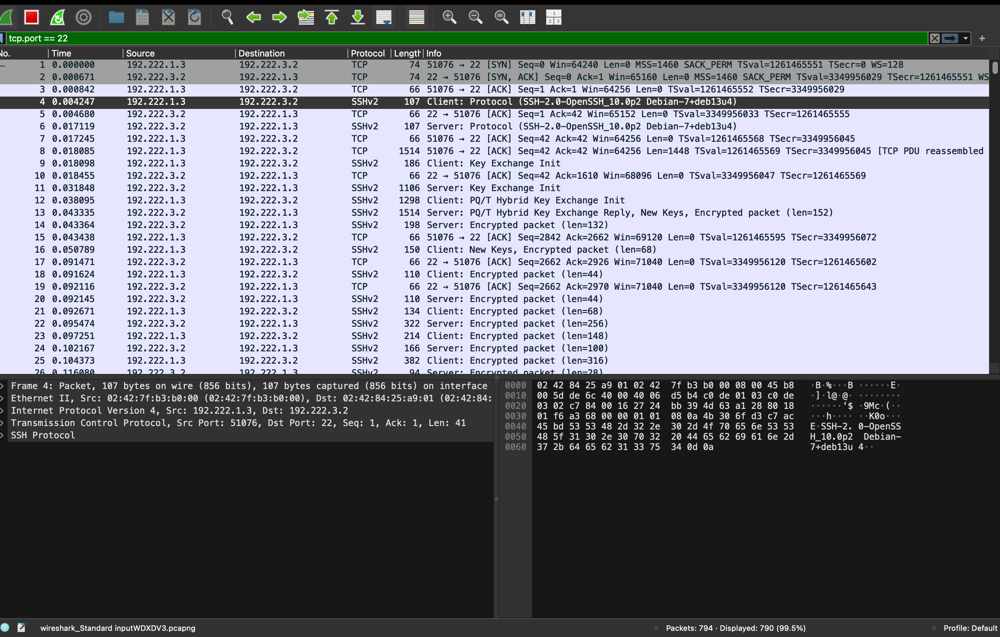

Hasil capture:
Berdasarkan hasil capture Wireshark, terlihat proses awal koneksi SSH berupa:
Protocol Version Exchange
Key Exchange
Pada tahap awal komunikasi SSH, client dan server melakukan pertukaran informasi versi protokol serta melakukan negosiasi algoritma enkripsi. Setelah proses pertukaran kunci selesai, komunikasi berikutnya sudah terenkripsi sehingga username maupun password tidak dapat terlihat dalam bentuk plaintext.
Hal tersebut berbeda dengan protokol Telnet yang mengirimkan kredensial tanpa enkripsi sehingga dapat dibaca menggunakan fitur Follow TCP Stream pada Wireshark.
Kesimpulan
Berdasarkan hasil konfigurasi dan pengujian:
SSH Server berhasil dijalankan pada node Knights.
User mika_admin berhasil melakukan autentikasi menggunakan public key.
Login SSH dapat dilakukan tanpa memasukkan password.
Paket SSH tidak menampilkan kredensial plaintext karena komunikasi telah terenkripsi.

14.Setelah gagal mengakses FTP, Eiri melancarkan serangan brute-force
terhadap form login web Alice. Analisis file capture wired_bruteforce.pcapng untuk mengidentifikasi alamat IP penyerang,target IP beserta port yang diserang, password user lain_admin yangberhasil ditembus, serta web server software dan versi yang dilaporkanpada response header. Validasi temuan kalian pada socket server:
(link file) nc [IP_Group] 3401

Eiri melakukan percobaan brute-force terhadap halaman login web Alice. Pada tahap ini dilakukan analisis terhadap file capture wired_bruteforce.pcapng untuk mengetahui informasi mengenai aktivitas serangan yang terjadi.
Analisis dilakukan menggunakan Wireshark dengan membuka file capture yang telah diberikan.

Pertama, dilakukan pencarian terhadap komunikasi HTTP yang terjadi selama proses brute-force.

Filter yang dilakukan:

``http``

atau untuk mencari request login:

`
http.request.method == POST
`


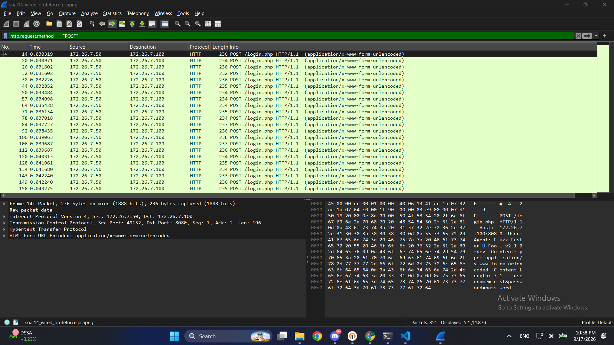

yang selanjutnya dilakukan adalah mencari diantara hasil filter yang sudah dilakukan yang "dianggap" mencurigakan 


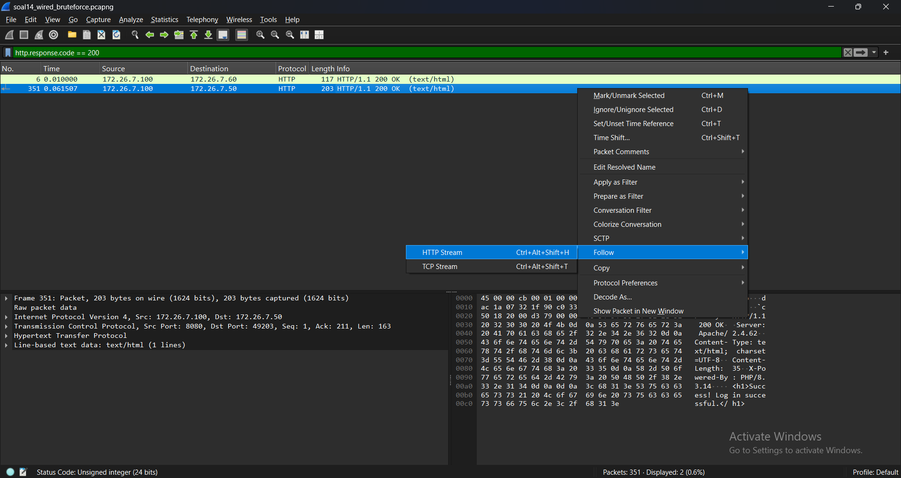

Lalu berdasarkan hal diatas didapatkan data data penting yaitu:


Selanjutnya dilakukan validasi hasil analisis menggunakan socket server:


```nc [IP_Group] 3401```


dengan IP Group A(10.4.89.246)


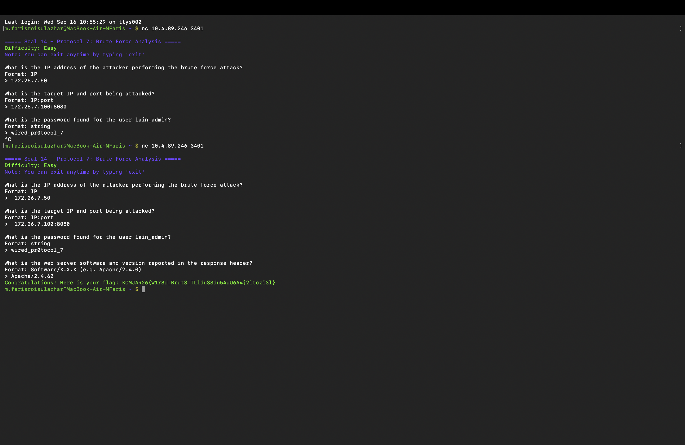


Analisis
Berdasarkan hasil capture wired_bruteforce.pcapng, terlihat adanya percobaan login berulang terhadap layanan web Alice. Aktivitas tersebut menunjukkan pola brute-force karena terdapat banyak request login dengan kombinasi kredensial yang berbeda.
Dari hasil analisis packet capture berhasil diperoleh:

1.alamat IP penyerang

2.alamat IP target

3.port layanan web

4.username dan password yang berhasil digunakan

5.informasi web server dari response header

6.Kesimpulan

Berdasarkan hasil pengamatan:

1.Serangan brute-force dapat diidentifikasi melalui banyaknya request HTTP POST menuju halaman login.

2.Kredensial yang berhasil ditemukan dapat dilihat melalui analisis isi komunikasi HTTP

3.Informasi web server dapat diperoleh melalui response header HTTP.

4.Hasil analisis telah divalidasi menggunakan socket server.


15. Eiri menyusup ke ruang server dan memasang perangkat keyboard USB berbahaya pada node Alice. Buka file capture wired usb_hid.pcap,identifikasi Vendor ID dan Product ID perangkat USB dari deskriptor USB,alamat nomor device USB, serta pesan rahasia yang berhasil dicuri darikeystroke. Validasi temuan kalian pada socket server:
(link file) nc [IP_Group] 3402

Analisis dilakukan menggunakan Wireshark dengan membuka file capture yang telah diberikan.

Pertama, dilakukan pencarian terhadap komunikasi USB yang terdapat pada file capture.
Filter yang digunakan:

`USB`

Selanjutnya dilakukan analisis terhadap USB Device Descriptor untuk mendapatkan identitas perangkat keyboard yang terhubung.
Pada paket USB Descriptor, informasi yang dicari yaitu:

  1.Vendor ID

  2.Product ID

  3.Device Number 

Cara mengambil datanya:
Klik paket USB → buka bagian:

`USB Device Descriptor`

Cari bagian:

```
idVendor
idProduct
Device Address
```
Setelah mendapatkan informasi perangkat USB, dilakukan analisis terhadap data HID Keyboard Report untuk mengetahui karakter yang dikirimkan oleh perangkat tersebut.
Filter yang digunakan:

`usb.capdata`

Data HID yang diperoleh kemudian dilakukan proses decoding untuk mengubah kode keyboard menjadi karakter.

Contoh:

`00 00 04 00 00 00 00 00`

Kemudian dilakukan konversi berdasarkan standar USB HID Keyboard.

Hasil decoding keystroke: Wired_Protocol_7_is_alive_2026

Hasil seluruh keycode:

Data yang dicatat:

Vendor ID: 0x046d

Product ID: 0xc31c

USB Device Address: 7

Secret Message: Wired_Protocol_7_is_alive_2026

Selanjutnya dilakukan validasi hasil analisis menggunakan socket server:

`nc [IP_Group] 3402`

Masukkan informasi:

1.Vendor ID

2.Product ID

3.Device Number

4.Pesan rahasia hasil decoding

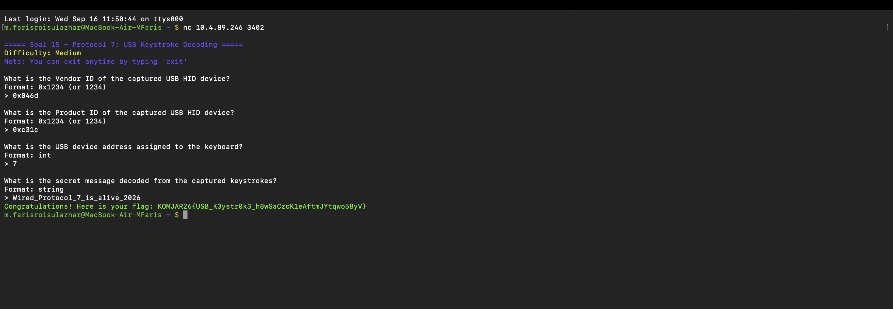

Analisis
Berdasarkan hasil capture wired_usb_hid.pcap, ditemukan adanya perangkat USB HID yang melakukan pengiriman data keyboard melalui protokol USB.Informasi perangkat diperoleh melalui USB Descriptor, sedangkan pesan rahasia diperoleh melalui analisis paket HID Keyboard Report.Karena perangkat keyboard mengirimkan input dalam bentuk kode HID, data tersebut perlu dilakukan decoding terlebih dahulu agar dapat diketahui karakter asli yang dikirimkan.

Kesimpulan

Berdasarkan hasil analisis:

1.Perangkat USB yang terhubung berhasil diidentifikasi melalui USB Descriptor.

2.Vendor ID dan Product ID perangkat berhasil ditemukan.

3.Data keystroke berhasil diperoleh melalui analisis HID Report.

4.Pesan rahasia berhasil di-decode dari komunikasi USB.

5.Hasil analisis berhasil divalidasi menggunakan socket server.

16. Eiri meletakkan file malware di server. Dari file capture wired_ftp_theft.pcap, lakukan analisis lalu lintas FTP untuk mengidentifikasi alamat IP server FTP penyerang, banner software FTP yang digunakan, kredensial login penyerang, serta ukuran (size in bytes) dari file malware knights_payload.exe yang diunduh. Validasitemuan kalian pada socket server:
(link file) nc [IP_Group] 3403

Pertama, dilakukan pencarian terhadap komunikasi FTP yang terdapat pada file capture.

Filter yang digunakan:

`ftp`

atau

`ftp.request`

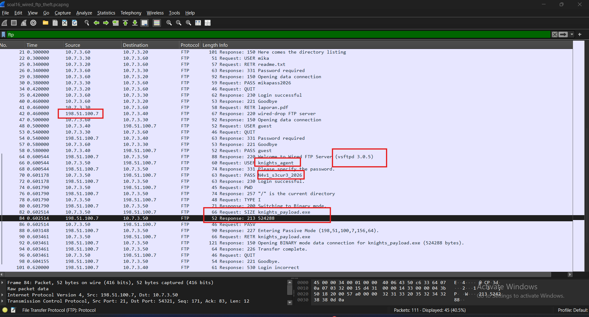

Selanjutnya dilakukan analisis terhadap proses koneksi FTP untuk mengetahui alamat IP server FTP yang digunakan oleh penyerang.
Pada paket FTP, lihat bagian:

`Internet Protocol Version 4`

Klik salah satu paket FTP → lihat:

``
Source:
Destination:
``

Selanjutnya dilakukan analisis terhadap banner FTP server untuk mengetahui software FTP yang digunakan.

Filter:

`ftp.response`

Setelah mengetahui server FTP, dilakukan analisis proses login untuk mendapatkan kredensial yang digunakan penyerang.
Karena FTP tidak menggunakan enkripsi, username dan password dapat terlihat pada komunikasi FTP.

Filter:

`ftp.request.command == USER || ftp.request.command == PASS`

Kemudian dilakukan analisis proses transfer file untuk mengetahui file malware yang diunduh.

Filter:

`ftp-data`

Lalu didapatkan hasil dari semua langkah di wireshark yaitu:

IP FTP server download -> `198.51.100.7`
version ftp server software -> `vsftpd 3.0.5`
user:pass -> knights_agent:`N4v1_s3cur3_2026`
size malware in bytes -> `524288`

Dan Hasil Validasinya:

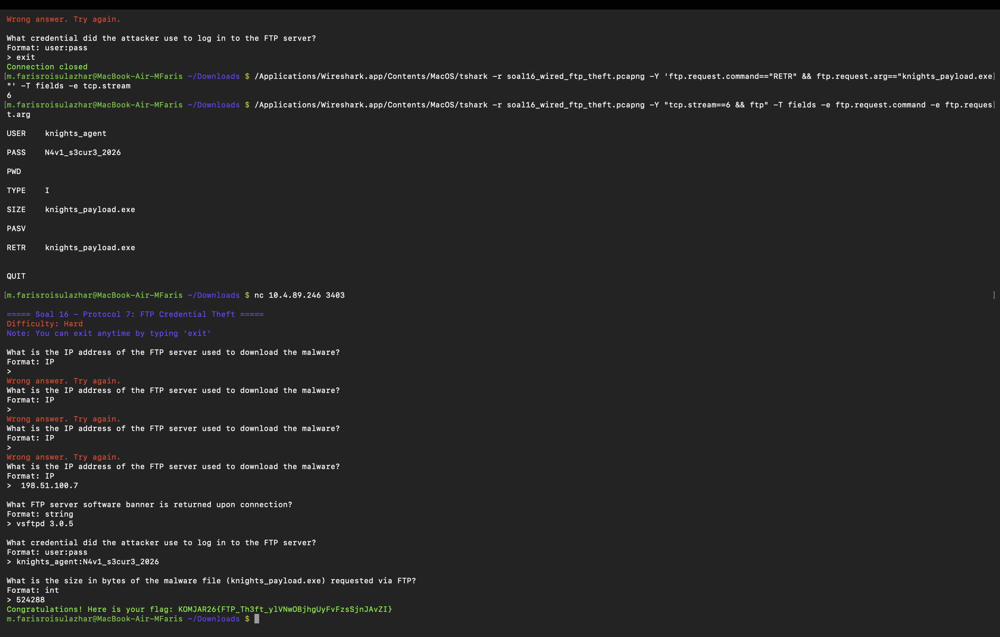
17. Alice membuat halaman web di node-nya. Eiri memanfaatkan celah untuk mengunduh payload berbahaya ke sistem Alice. Analisis file capture wired_http_c2.pcap untuk mengidentifikasi nama domain (Host) tempat malware diunduh, alamat IP server penyerang, nama file executable malware yang diunduh, serta kode status HTTP yang dikembalikan. Validasi temuan kalian pada socket server:
(link file) nc [IP_Group] 3404

Alice membuat halaman web pada node miliknya. Eiri memanfaatkan celah tersebut untuk mengunduh payload berbahaya ke sistem Alice. Pada tahap ini dilakukan analisis terhadap file capture wired_http_c2.pcap untuk mengetahui informasi komunikasi malware melalui protokol HTTP.Analisis dilakukan menggunakan Wireshark dengan membuka file capture yang telah diberikan.

Pertama, dilakukan pencarian terhadap komunikasi HTTP yang terdapat pada file capture.

Filter yang digunakan:

`http`

atau

`http.request`


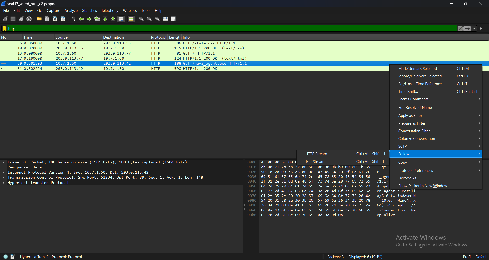

Selanjutnya dilakukan analisis terhadap hasil filter untuk mengetahui domain atau host tempat malware diunduh.
Pada paket HTTP ,lihat bagian bawah:

`Hypertext Transfer Protocol`

cari bagian:

`Host:`

Kemudian dilakukan analisis terhadap alamat IP server penyerang.
Pada paket HTTP, 
lihat bagian:

`Internet Protocol Version 4`

Cara mengambil:
Klik paket HTTP → lihat:

``
Source:
Destination:
``

Selanjutnya dilakukan analisis terhadap file executable yang dikirimkan oleh server.
Gunakan fitur:

`Follow → TCP Stream`

Selanjutnya dilakukan pengecekan response HTTP dari server untuk mengetahui status code yang diberikan.
Filter:

`http.response.code`

Dari hal diatas didapatkan beberapa informasi penting yaitu:

HOST        : `wired-update.net`

IP address  : `203.0.113.42`

nama file   : `navi_agent.exe`

http status response: `200`

Selanjutnya dilakukan validasi:

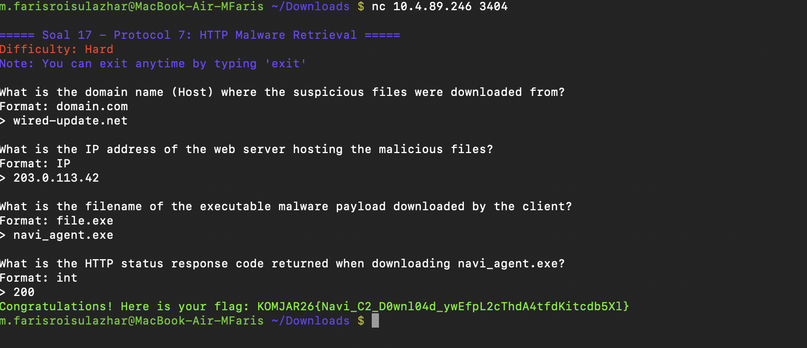

Analisis
Berdasarkan hasil capture wired_http_c2.pcap, ditemukan adanya komunikasi antara client dengan server penyerang menggunakan protokol HTTP.Dari hasil analisis paket HTTP diperoleh informasi:

1.Host atau domain yang digunakan untuk mengunduh malware.

2.Alamat IP server penyerang.

3.Nama file executable malware.

4.Status response HTTP dari server.

5.Komunikasi tersebut menunjukkan bahwa malware melakukan pengunduhan payload melalui request HTTP biasa.

Kesimpulan

Berdasarkan hasil pengamatan:

1.Traffic HTTP berhasil dianalisis menggunakan Wireshark.

2.Domain tempat malware diunduh berhasil ditemukan.

3.IP server penyerang berhasil diidentifikasi.

4.File executable malware berhasil diketahui.

5.HTTP response code berhasil diperoleh.

5.Hasil analisis berhasil divalidasi menggunakan socket server.

18. Eiri mengubah taktik penyerangan dengan menanamkan file malware
menggunakan protokol file sharing SMB. Analisis file capture wired smb_transfer.pcapng untuk mengidentifikasi nama protokol
jaringan yang dieksploitasi, IP pengirim dan penerima, folder tujuan penyimpanan malware pada sistem korban, serta nama file executable malware yang ditransfer. Validasi temuan kalian pada socket server:
(link file) nc [IP_Group] 3405

Eiri mengubah metode serangan dengan menanamkan file malware menggunakan protokol SMB (Server Message Block). Pada tahap ini dilakukan analisis terhadap file capture wired_smb_transfer.pcapng untuk mengetahui informasi mengenai komunikasi transfer file malware melalui protokol SMB.
Analisis dilakukan menggunakan Wireshark dengan membuka file capture yang telah diberikan.
Pertama, dilakukan pencarian terhadap komunikasi SMB pada file capture.
Filter yang digunakan:

`smb2`

atau 

`smb`


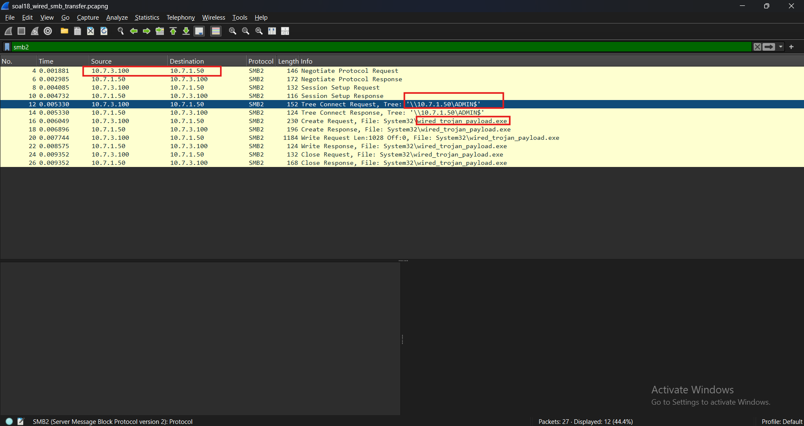

Kemudian dilakukan analisis terhadap alamat IP pengirim dan penerima file malware.
Pada paket SMB, lihat bagian:


`Internet Protocol Version 4`

Cara mengambil:
Klik paket SMB → buka:

`Internet Protocol`

Ambil:

``
Source:
Destination:

``

Selanjutnya dilakukan analisis terhadap lokasi folder tujuan penyimpanan file malware pada sistem korban.
Pada paket SMB, buka bagian:

`SMB2`

Cari bagian:
`File Name` 
atau:
`Create Request File`

Selanjutnya dilakukan identifikasi nama file executable malware yang ditransfer.Pada paket SMB, cari:

`SMB2 Create Request`

atau:

`File Name`

Selanjutnya didapatkan hal hal yang penting yaitu:

Protocol : `SMB2`

Sender IP: `10.7.3.100`

Receiver IP: `10.7.1.50`

Folder   : `ADMIN$\System32`

File     : `wired_trojan_payload.exe`

Lalu Validasi hal hal tersebut:

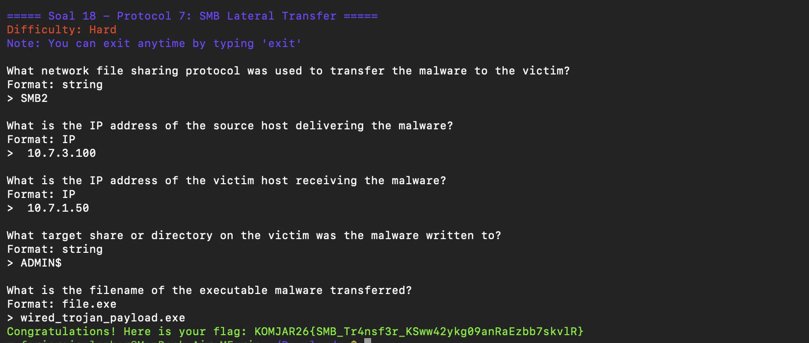

Analisis
Berdasarkan hasil capture wired_smb_transfer.pcapng, ditemukan adanya aktivitas transfer file menggunakan protokol SMB.
Dari hasil analisis paket SMB diperoleh informasi:

1 Protokol jaringan yang digunakan untuk transfer file.

2.Alamat IP pengirim dan penerima.

3.Lokasi folder tujuan pada sistem korban.

4.Nama file executable malware yang dikirimkan.

5.SMB memungkinkan proses berbagi file melalui jaringan sehingga apabila konfigurasi keamanan tidak diterapkan dengan baik protokol ini dapat dimanfaatkan untuk melakukan transfer file berbahaya.

Kesimpulan

Berdasarkan hasil pengamatan:

1.Traffic SMB berhasil ditemukan menggunakan Wireshark.

2.Protokol transfer malware berhasil diidentifikasi.

3.IP pengirim dan penerima berhasil diperoleh.

4.Lokasi penyimpanan malware pada sistem korban berhasil ditemukan.

5.Nama file executable malware berhasil diketahui.

6.Hasil analisis berhasil divalidasi menggunakan socket server.

19. Eiri meneror jaringan dengan mengirimkan email pemerasan melalui
protokol SMTP tanpa enkripsi. Analisis file capture wired_smtp_threat.pcap pada stream TCP terkait, identifikasi alamat email korban yang ditargetkan, password korban yang diklaim bocor oleh penyerang, jenis malware yang diinfeksikan, batas waktu (dalam hari) yang diberikan, serta MailClientID yang tercantum pada pesan.Validasi temuan kalian pada socket server:
(link file) nc [IP_Group] 3406

Eiri meneror jaringan dengan mengirimkan email pemerasan melalui protokol SMTP tanpa enkripsi. Pada tahap ini dilakukan analisis terhadap file capture wired_smtp_threat.pcap untuk mengetahui informasi yang terdapat pada pesan email ancaman tersebut.Analisis dilakukan menggunakan Wireshark dengan membuka file capture yang telah diberikan.
Pertama, dilakukan pencarian terhadap komunikasi SMTP pada file capture.
Filter yang digunakan:

`smtp`

atau:

`tcp.port == 25`


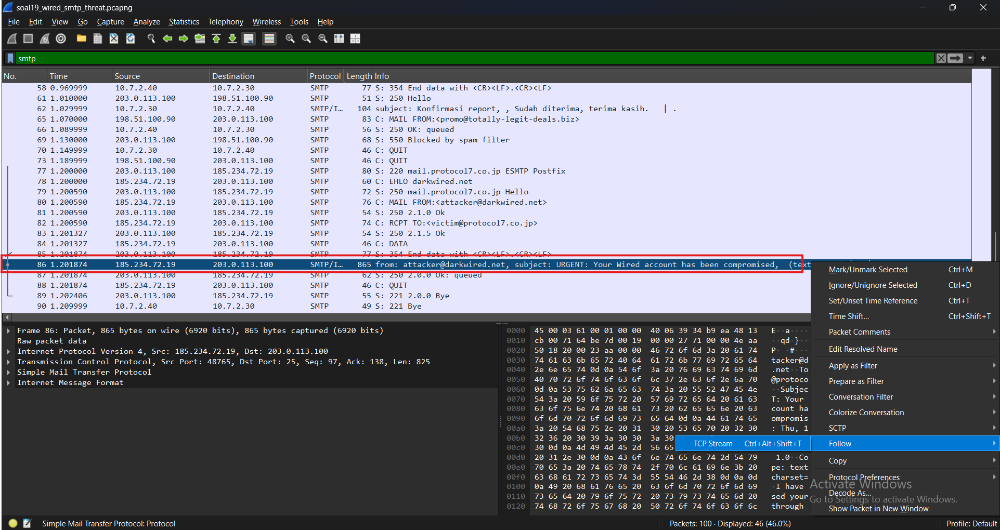

Selanjutnya dilakukan analisis terhadap sesi TCP yang berisi pesan email ancaman.
Untuk melihat isi pesan, digunakan fitur:
Right Click Packet
→ `Follow`
→ `TCP Stream`

Lalu dari hal tersebut akan di dapatkan sesuatu yang penting:

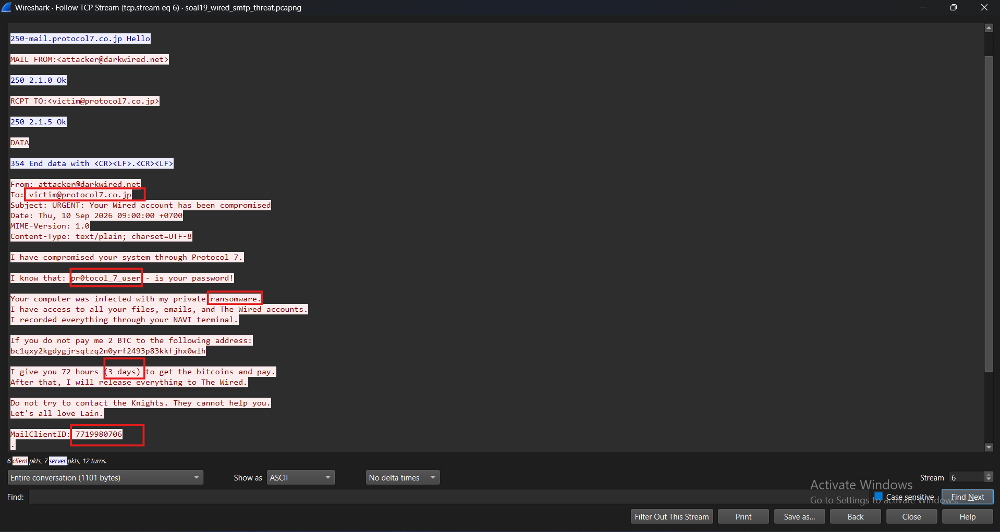

Yang selanjutnya akan di validasi:


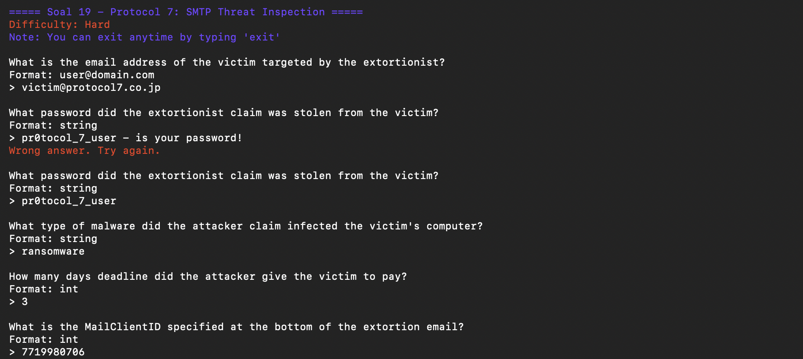


Analisis
Berdasarkan hasil capture wired_smtp_threat.pcap, ditemukan adanya komunikasi email menggunakan protokol SMTP tanpa enkripsi.
Karena SMTP tidak mengenkripsi isi pesan secara default, isi email dapat dianalisis menggunakan fitur Follow TCP Stream pada Wireshark.Dari hasil analisis ditemukan informasi:
`alamat email korban`,`password yang diklaim berhasil diperoleh penyerang`,`jenis malware yang digunakan`,`batas waktu ancaman`,`identitas MailClientID pada pesan`.
Kesimpulan

Berdasarkan hasil pengamatan:

1.Traffic SMTP berhasil ditemukan menggunakan Wireshark.

2.Isi email ancaman berhasil dibaca melalui TCP Stream.

3.Informasi korban dan ancaman malware berhasil diidentifikasi.

4.MailClientID berhasil ditemukan.

5.Hasil analisis berhasil divalidasi menggunakan socket server.

20. Untuk rencana pamungkasnya, Eiri menyembunyikan komunikasi malware di balik saluran terenkripsi TLS. Namun Alice telah
menyediakan file keylog untuk mendekripsi lalu lintas data tersebut.Analisis file capture wired_tls_decrypt.pcapng bersama keyslogfile.txt untuk mengidentifikasi versi protokol TLS yang dinegosiasikan, nama domain (SNI) yang diakses, alamat IP server HTTPS penyerang,User-Agent yang digunakan, serta HTTP request method dan path yang tersembunyi di dalam sesi dekripsi. Validasi temuan kalian pada socket server: (link file) nc [IP_Group] 3407

Eiri menyembunyikan komunikasi malware di balik saluran terenkripsi TLS. Namun Alice menyediakan file keylog yang dapat digunakan untuk melakukan dekripsi terhadap lalu lintas TLS.
Pada tahap ini dilakukan analisis terhadap file capture wired_tls_decrypt.pcapng menggunakan file keyslogfile.txt untuk mengetahui informasi komunikasi HTTPS yang sebelumnya terenkripsi.
Pertama, dilakukan konfigurasi Wireshark agar dapat membaca file keylog TLS.
Masuk ke:
Edit
→ `Preferences`
→ `Protocols`
→ `TLS`
Kemudian masukkan file:
`keyslogfile.txt`
pada bagian:
`(Pre)-Master-Secret log filename`


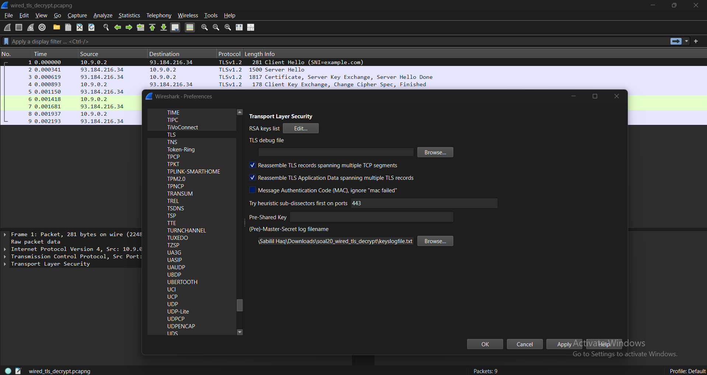

Setelah file keylog dimasukkan, dilakukan pembukaan file capture:

`wired_tls_decrypt.pcapng`

Kemudian digunakan filter:

`tls`


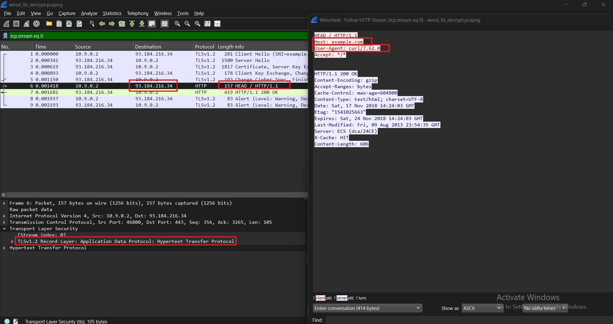


Pada paket TLS, buka bagian:
`Transport Layer Security`
Cari:
`TLS Record Layer`
dan:
`Handshake Protocol`

Untuk mengetahui domain yang diakses oleh client, dilakukan analisis pada paket TLS Client Hello.
Filter:
`tls.handshake.type == 1`
Kemudian buka bagian:
`Handshake Protocol: Client Hello`
Cari:
`Extension: server_name`

Selanjutnya dilakukan identifikasi alamat IP server HTTPS yang menjadi tujuan komunikasi.
Pada paket TLS lihat:
`Internet Protocol Version 4`

Setelah TLS berhasil didekripsi menggunakan file keylog, komunikasi HTTP dapat terlihat kembali.
Filter:
`http`
Kemudian cari:
`Hypertext Transfer Protocol`

Setelah semua hal tersebut dilakukan didapatkan hal hal penting yaitu:
TLS Version         : `TLSv1.2`

Host                : `example.com`

IP address HTTPS    : `93.184.216.34`

User-Agent string   : `curl/7.62.0`

Request methode     : `HEAD`

Analisis
Berdasarkan hasil capture wired_tls_decrypt.pcapng, komunikasi malware menggunakan protokol TLS berhasil dianalisis setelah file keylog dimasukkan ke konfigurasi Wireshark.Sebelum dilakukan dekripsi, data HTTPS tidak dapat dibaca karena terenkripsi. Setelah menggunakan file keyslogfile.txt, sesi TLS dapat didekripsi sehingga informasi HTTP yang berada di dalam komunikasi tersebut dapat diamati.Dari hasil analisis diperoleh:
`versi protokol TLS yang digunakan`,`domain tujuan berdasarkan SNI`,`alamat IP server HTTPS`,`User-Agent client`,`HTTP request methodpath yang diakses`.

Kesimpulan

Berdasarkan hasil pengamatan:

1.File keylog berhasil digunakan untuk mendekripsi komunikasi TLS.

2.Versi TLS berhasil diidentifikasi.

3.Domain tujuan berhasil ditemukan melalui SNI.

4.IP server HTTPS berhasil diperoleh.

5.HTTP request yang sebelumnya terenkripsi berhasil dianalisis.

6.Hasil analisis berhasil divalidasi menggunakan socket server.


