# Jarkom-Modul-1-2026-K-22

**Anggota Kelompok**
| Nama                   | NRP        |
| ---------------------- | ---------- |
| Muhamad Sabilil Haq    | 5027251041 |
| M. Faris Roisul Azhar    | 5027251048 |

# Laporan Praktikum

1. Menyiapkan router bernama `Lain` dan membuat 3 switch dari router tersebut. Switch pertama, terdapat dua entitas (client), yaitu `Alice` dan `Mika`. Switch kedua, membawahi satu entitas (server), yaitu `Chisa`. Terakhir, switch ketiga terdapat dua entitas (client), yaitu `Knights` dan `Eiri`.

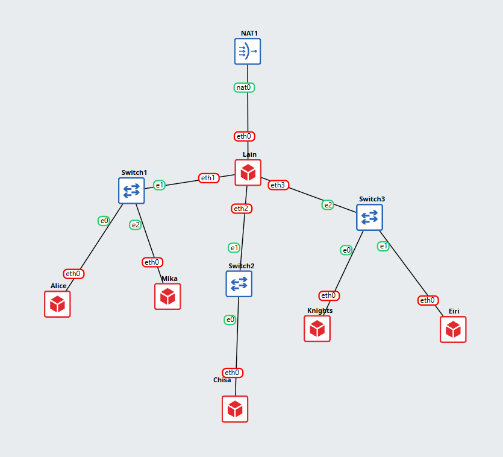

Berikut merupakan konfigurasi dari kelima entitas tersebut. Disini, prefix IP dari kelompok kami adalah 192.222.X.X
  - Alice (switch 1)
```
auto eth0
iface eth0 inet static
    address 192.222.1.2
    netmask 255.255.255.0
    gateway 192.222.1.1
```
  - Mika (switch 1)
```
auto eth0
iface eth0 inet static
    address 192.222.1.3
    netmask 255.255.255.0
    gateway 192.222.1.1
```
  - Chisa (switch 2)
```
auto eth0
iface eth0 inet static
    address 192.222.2.2
    netmask 255.255.255.0
    gateway 192.222.2.1
```
  - Knights (switch 3)
```
auto eth0
iface eth0 inet static
    address 192.222.3.2
    netmask 255.255.255.0
    gateway 192.222.3.1
```
  - Eiri (switch 3)
```
auto eth0
iface eth0 inet static
    address 192.222.3.3
    netmask 255.255.255.0
    gateway 192.222.3.1
```
---

2. Pada saat itu, jaringan di The Wired masih terisolasi, sehingga dibutuhkan koneksi jaringan internet. Disini, kami menggunakan NAT yang dihubungkan dengan `Lain` (router) agar  dapat tersambung langsung ke jaringan internet publik. Kemudian, inilah konfigurasi dari routernya.
```
auto eth0
iface eth0 inet dhcp
```
test koneksi:

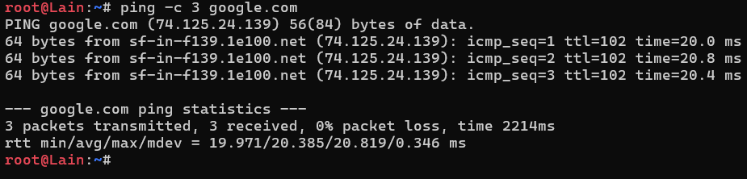

---

3. Di sisi lain, kita juga perlu menghubungkan kelima entitas, agar mereka bisa saling berinteraksi dan juga memastikan mereka terhubung dengan internet. Disini, peran `Lain` (router) adalah sebagai perantara yang menghubungkan kelima entitas tersebut. Untuk itu, terdapat beberapa tambahan pada konfigurasi `Lain`, sehingga konfigurasi `Lain` menjadi seperti ini.
```
auto eth0
iface eth0 inet dhcp

auto eth1
iface eth1 inet static
    address 192.222.1.1
    netmask 255.255.255.0

auto eth2
iface eth2 inet static
    address 192.222.2.1
    netmask 255.255.255.0

auto eth3
iface eth3 inet static
    address 192.222.3.1
    netmask 255.255.255.0
```

test keterhubungan kelima entitas
  - Alice to others
    
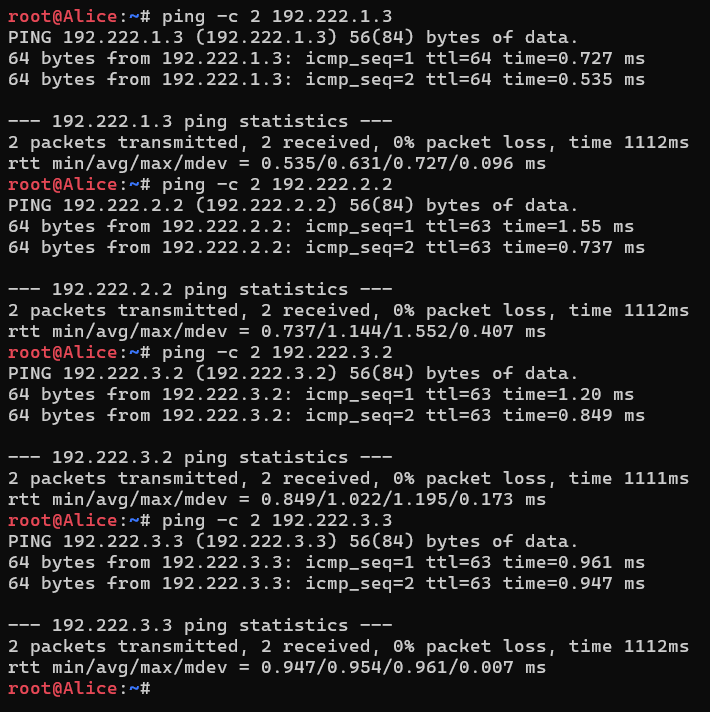

  - Mika to others
    
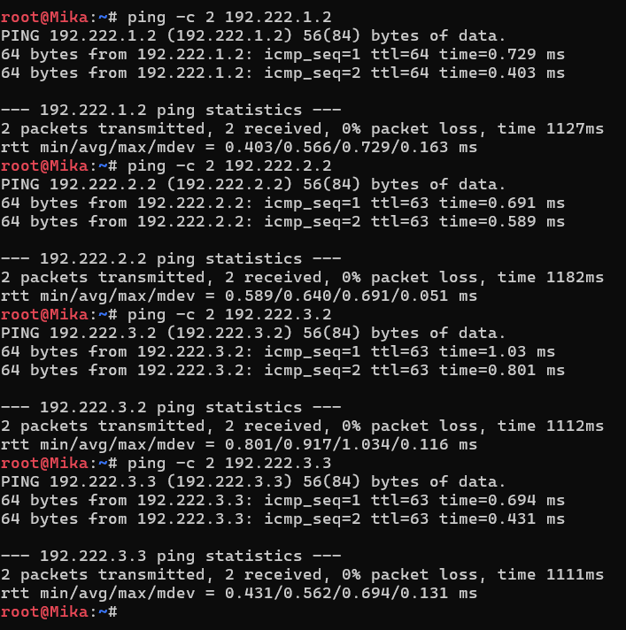

  - Chisa to others
    
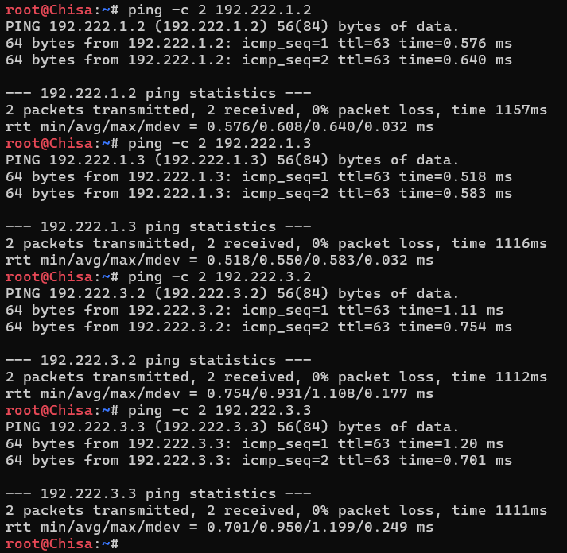

  - Knights to others
    
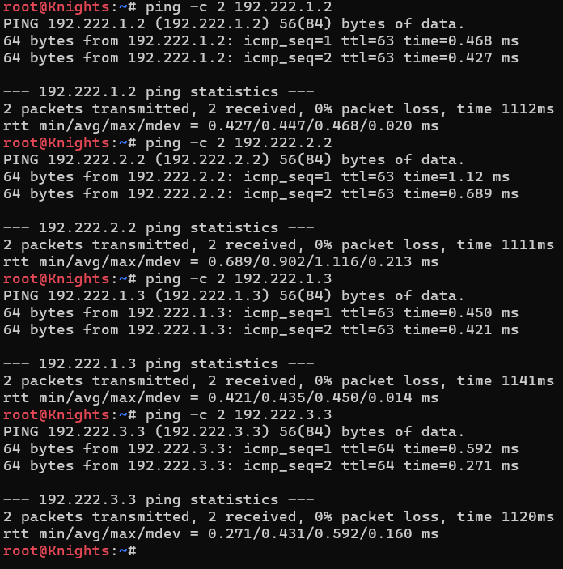

  - Eiri to others
    
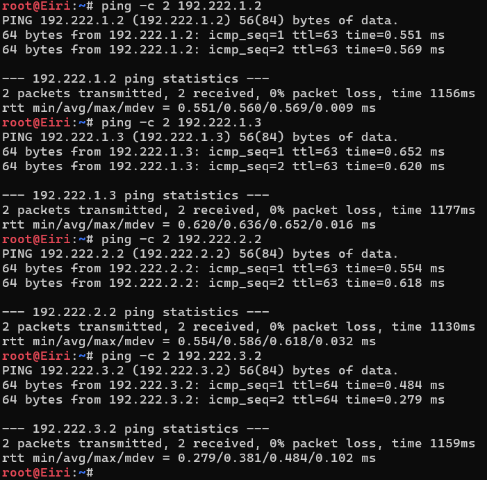

---

4. Agar kelima entitas dapat melakukan koneksi dengan internet. Ditambahkan lagi konfigurasi pada `Lain` berupa firewall/iptables (NAT Masquerade) dan juga kelima entitas tersebut diisi dengan DNS resolver (disini kami menjalankan script [fix_dns.sh](4/script%20yang%20ada%20di%20tiap%20entitas/fix_dns.sh) di kelima entitasnya).
  - Konfigurasi tambahan pada router `Lain`, sehingga konfigurasinya menjadi:
```
auto eth0
iface eth0 inet dhcp
    up sysctl -w net.ipv4.ip_forward=1
    up iptables -t nat -A POSTROUTING -o eth0 -j MASQUERADE

auto eth1
iface eth1 inet static
    address 192.222.1.1
    netmask 255.255.255.0

auto eth2
iface eth2 inet static
    address 192.222.2.1
    netmask 255.255.255.0

auto eth3
iface eth3 inet static
    address 192.222.3.1
    netmask 255.255.255.0
```
`up sysctl -w net.ipv4.ip_forward=1`: Mengaktifkan fitur IP Forwarding pada sistem operasi agar komputer/router diizinkan untuk meneruskan paket data dari jaringan lokal (LAN) menuju jaringan luar (Internet).

`up iptables -t nat -A POSTROUTING -o eth0 -j MASQUERADE`: Mengaktifkan NAT (Network Address Translation) dengan metode IP Masquerading untuk menyamarkan IP privat perangkat lokal menjadi IP publik milik kartu jaringan `eth0` saat mengakses internet.

  - test koneksi kelima entitas:
    
  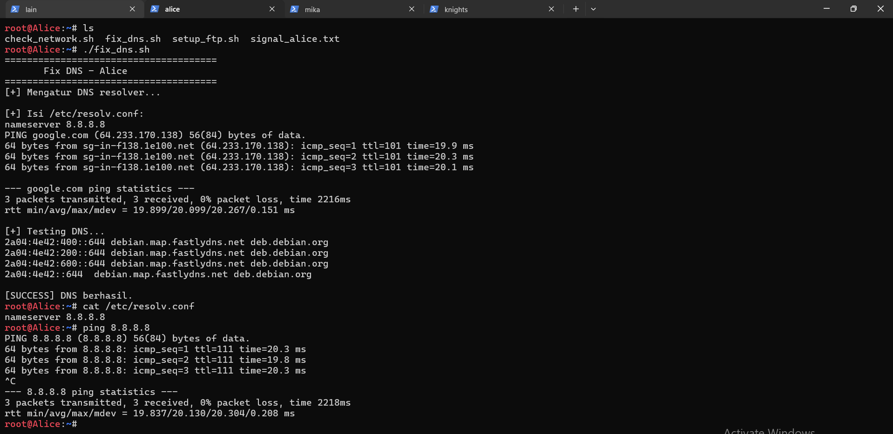
  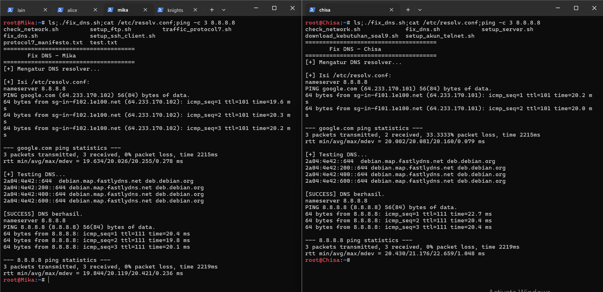
  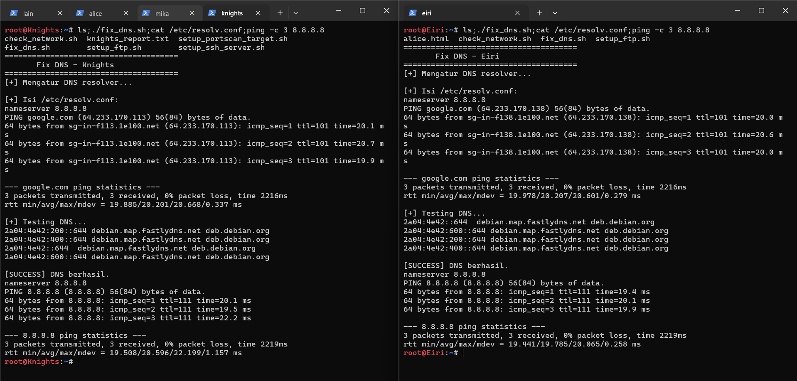

---

5. Untuk memastikan seluruh konfigurasi jaringan tidak hilang saat semua node di-restart, dibuatlah script [cek_status.sh](5/cek_status.sh) untuk mengeceknya. Cek hasilnya:


---

6. Mika mencurigai adanya anomali traffic pada segmen jaringannya. Untuk mengidentifikasi traffic tersebut, dijalankan [traffic generator](6/traffic_protocol7.sh) pada node `Mika`, kemudian dilakukan packet sniffing menggunakan Wireshark pada interface yang terhubung dengan `Mika`. Setelah proses capture berjalan, diterapkan display filter berikut:

    ```dns || icmp```

Filter tersebut digunakan untuk menampilkan paket yang menggunakan protokol **DNS** atau **ICMP** saja. Hasil packet capture setelah filter diterapkan adalah sebagai berikut.


Berdasarkan hasil capture, terdapat beberapa jenis traffic yang berhasil disaring oleh filter, yaitu:

- **ICMP**, berupa `Echo (ping) request` dan `Echo (ping) reply`. Traffic tersebut terlihat berasal dari `192.222.1.3` yang merupakan alamat IP node `Mika`, menuju `8.8.8.8` dan `1.1.1.1`, kemudian mendapatkan response kembali.
- **DNS**, berupa `Standard query` dan `Standard query response`. Terlihat adanya permintaan DNS dari `192.222.1.3` menuju `8.8.8.8` maupun `1.1.1.1` untuk melakukan resolusi beberapa domain, seperti `example.com`, `github.com`, `its.ac.id`, `google.com`, dan `cloudflare.com`.
- Pada bagian bawah Wireshark terlihat bahwa terdapat **51 paket yang berhasil ditangkap**, dengan **36 paket ditampilkan setelah filter diterapkan**, atau sekitar **70,6%** dari keseluruhan paket yang tertangkap.

Dengan demikian, display filter `dns || icmp` berhasil menyaring traffic sehingga hanya paket yang menggunakan protokol **DNS dan ICMP** yang ditampilkan. Hasil ini mempermudah pengamatan terhadap pola komunikasi DNS serta aktivitas ICMP pada node `Mika`.

---

7. Chisa memutuskan untuk mendirikan FTP Server dengan shared folder pada `/var/wired/data`. Konfigurasi dilakukan dengan membuat user `alice`, `mika`, dan `eiri`, kemudian menerapkan hak akses yang berbeda sesuai dengan ketentuan. Berdasarkan konfigurasi yang dibuat, `alice` memiliki hak akses **read & write**, `mika` memiliki hak akses **read-only**, sedangkan `eiri` dimasukkan ke dalam **FTP blacklist** sehingga tidak diperbolehkan mengakses FTP Server. :contentReference[oaicite:0]{index=0}

Pada node `Chisa`, terlebih dahulu dijalankan script [`setup_server.sh`](7/setup_server.sh) untuk menyiapkan FTP Server, shared folder, serta akun pengguna. Selanjutnya, script [`setup_ftp.sh`](7/setup_ftp.sh) dijalankan pada node yang membutuhkan FTP client. :contentReference[oaicite:1]{index=1}

Konfigurasi `vsftpd` menggunakan `/var/wired/data` sebagai `local_root` dan mengaktifkan akses pengguna lokal serta kemampuan menulis. Selain itu, digunakan konfigurasi `userlist` untuk membatasi akses user `eiri`. :contentReference[oaicite:2]{index=2}

### Pengujian user Alice

Untuk membuktikan bahwa user `alice` memiliki hak akses **read & write**, dilakukan koneksi FTP dari node `Alice` menuju FTP Server pada node `Chisa` menggunakan alamat IP `192.222.2.2`.

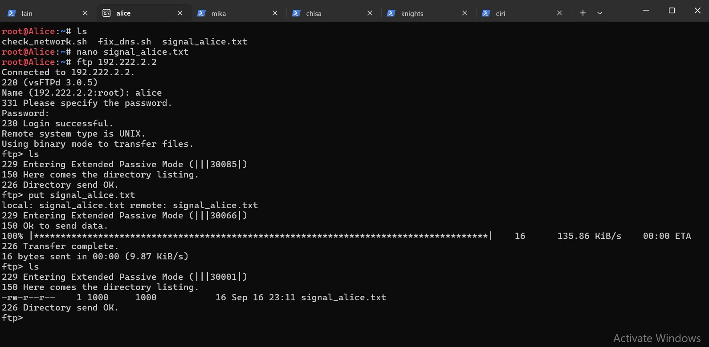

Setelah berhasil login sebagai user `alice`, dilakukan pengecekan isi direktori menggunakan perintah `ls`. Selanjutnya, file `signal_alice.txt` dibuat pada node `Alice` dan dikirim ke FTP Server menggunakan perintah `put signal_alice.txt`. Proses transfer berhasil dilakukan dan ditunjukkan dengan pesan `226 Transfer complete`.

Setelah proses upload selesai, dilakukan kembali pengecekan menggunakan `ls`. File `signal_alice.txt` terlihat pada direktori FTP Server dengan ukuran **16 bytes**, sehingga dapat dibuktikan bahwa user `alice` memiliki hak akses **write** pada shared folder tersebut.

### Pengujian user Eiri

Selanjutnya dilakukan pengujian menggunakan user `eiri` dari node `Eiri` untuk memastikan bahwa user tersebut tidak memiliki izin untuk mengakses FTP Server.

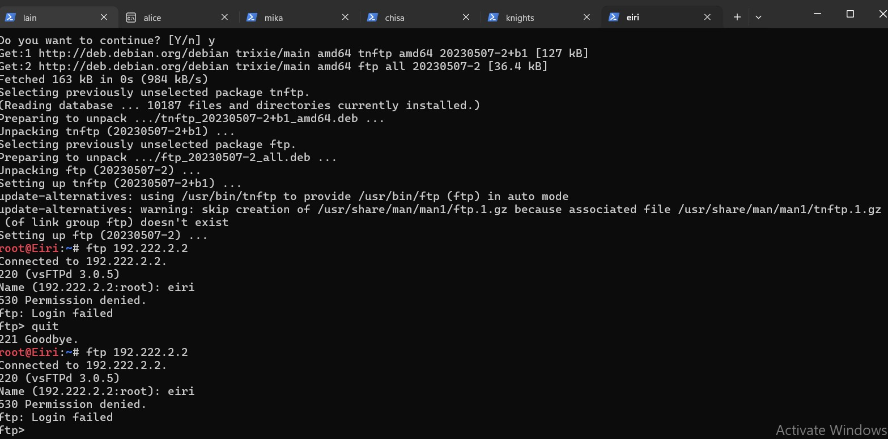

Saat mencoba melakukan koneksi ke FTP Server `192.222.2.2` menggunakan username `eiri`, server memberikan respons:

```text
530 Permission denied.
ftp: Login failed
```

---

8. Kelompok rahasia `Knights` perlu mengirimkan dokumen laporan intelijen ke FTP Server `Chisa`. Pada tahap ini, dilakukan koneksi FTP client dari node `Knights` menuju FTP Server `Chisa` menggunakan akun `alice`. Setelah berhasil login, file `knights_report.txt` diunggah ke server menggunakan perintah FTP `STOR`.

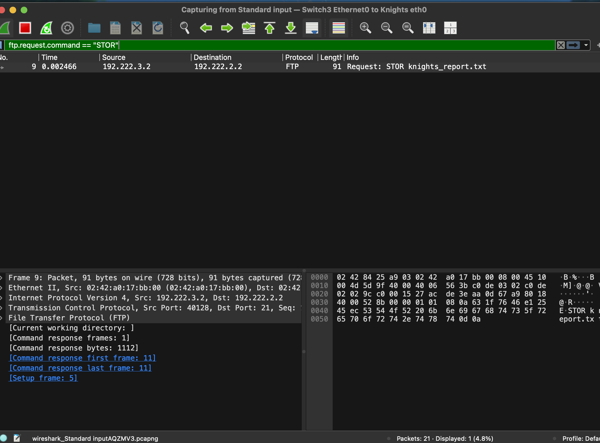

Berdasarkan hasil capture Wireshark, terlihat bahwa node `Knights` dengan alamat IP `192.222.3.2` mengirimkan perintah `STOR knights_report.txt` menuju FTP Server `Chisa` dengan alamat IP `192.222.2.2`. Perintah `STOR` digunakan oleh FTP untuk mengunggah atau menyimpan file ke server.

Selanjutnya, server memberikan respons dengan kode status `226`, yang menunjukkan bahwa proses transfer file telah berhasil diselesaikan.

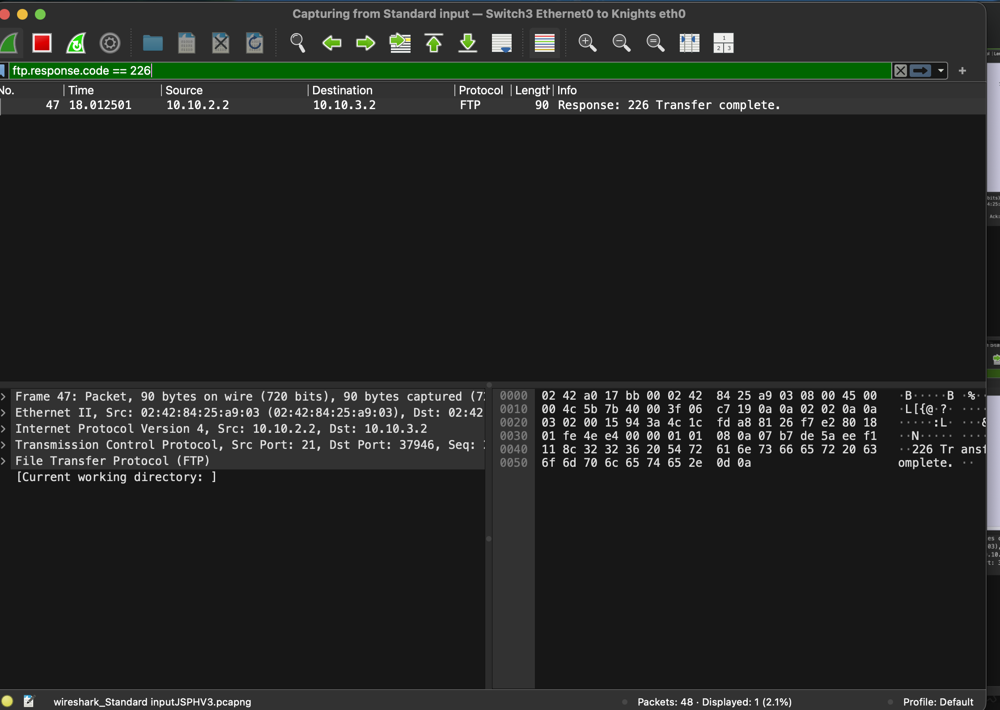

Pada proses transfer, koneksi menggunakan mode passive. Dari hasil capture, terlihat negosiasi `EPSV` (Extended Passive Mode) dengan port data TCP `30056`. Port tersebut kemudian digunakan sebagai koneksi data untuk proses transfer file, sedangkan koneksi kontrol FTP tetap menggunakan port `21`.

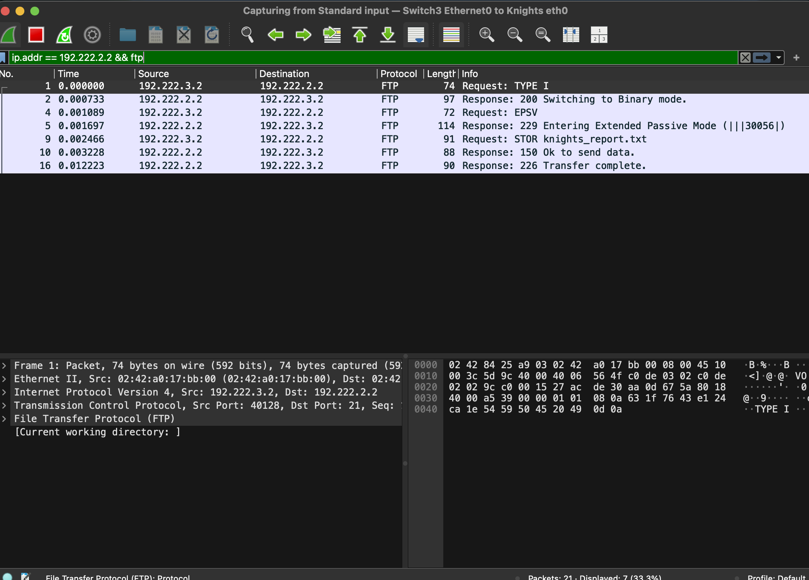

Dengan demikian, hasil analisis sesi FTP adalah sebagai berikut:

- **Perintah upload:** `STOR knights_report.txt`
- **Kode status keberhasilan:** `226 Transfer complete`
- **Mode transfer:** Passive (`EPSV`)
- **Port data TCP:** `30056`
- **Port kontrol FTP:** `21`

Hasil capture menunjukkan bahwa proses upload file dari `Knights` ke `Chisa` berhasil dilakukan melalui FTP menggunakan akun `alice`.

---

9. Mika mengakses dokumen `protocol7_manifesto.txt` dari FTP Server `Chisa` menggunakan akun `mika`. Sebelum itu, lakukan dulu pengunduhan pada dokumen `protocol7_manifesto` tersebut menggunakan [download_kebutuhan_soal9.sh](9/download_kebutuhab_soal9.sh).

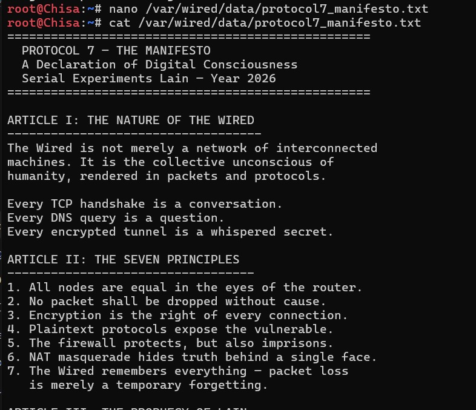

Selanjutnya, lakukan pengujuan.

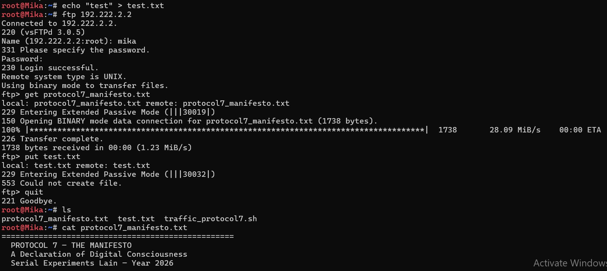

Berdasarkan hasil pengujian, node `Mika` berhasil terhubung ke FTP Server Chisa pada alamat `192.222.2.2` menggunakan akun `mika`. Proses download dokumen `protocol7_manifesto.txt` berhasil dilakukan dengan perintah `get protocol7_manifesto.txt`, ditunjukkan dengan pesan `226 Transfer complete`.

Sedangkan, berdasarkan hasil pengujian, proses upload file `test.txt` tidak berhasil. FTP Server memberikan respons:

```text
229 Entering Extended Passive Mode (|||30032|)
550 Could not create file.
```

Respons dengan kode `550` menunjukkan bahwa server menolak operasi pembuatan atau penulisan file pada directory FTP. Hal ini membuktikan bahwa akun `mika` memiliki hak akses **read-only**. Akun `mika` dapat melakukan operasi pembacaan seperti `get`, tetapi tidak dapat melakukan operasi penulisan seperti `put`.

Dengan demikian, pembatasan akses akun `mika` pada FTP Server Chisa berhasil dibuktikan sebagai berikut:

- **Akun:** `mika`
- **Hak akses:** Read-only
- **Operasi download:** Berhasil menggunakan `get protocol7_manifesto.txt`
- **Status download:** `226 Transfer complete`
- **Operasi upload:** Gagal menggunakan `put test.txt`
- **Status upload:** `550 Could not create file`
- **Mode transfer:** Passive / `EPSV`
- **Port data TCP saat upload:** `30032`

---

10. Knights melancarkan uji ketahanan koneksi ke server `Chisa` untuk menguji latensi jaringan The Wired. Pengujian dilakukan dengan mengirimkan paket `ping` dari node `Knights` ke node `Chisa` dengan payload khusus 128 bytes, interval 0.3 detik, dan sebanyak 77 paket menggunakan perintah berikut:

```bash
ping -c 77 -s 128 -i 0.3 192.222.2.2
```

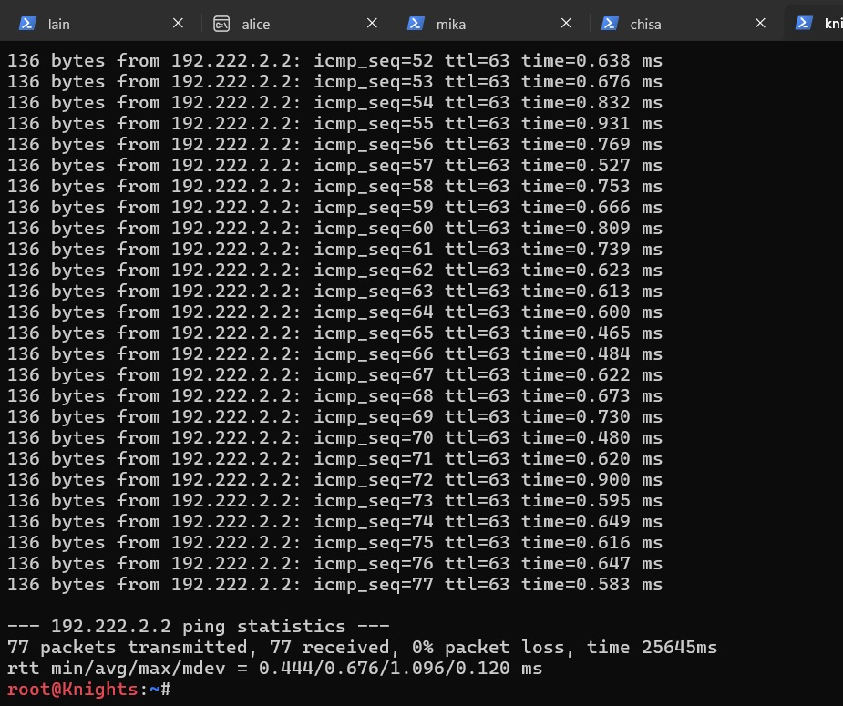

Berdasarkan hasil pengujian, node `Knights` dengan alamat IP `192.222.3.2` berhasil berkomunikasi dengan node `Chisa` pada alamat IP `192.222.2.2`. Seluruh paket yang dikirimkan mendapatkan respons dari server, sehingga tidak terjadi packet loss.

Hasil statistik `ping` menunjukkan:

- **Packets transmitted:** 77
- **Packets received:** 77
- **Packet loss:** 0%
- **RTT minimum:** 0.444 ms
- **RTT average:** 0.676 ms
- **RTT maximum:** 1.096 ms
- **RTT standard deviation:** 0.120 ms

Selanjutnya dilakukan analisis menggunakan Wireshark untuk melihat paket `ICMP Echo Request` dan `ICMP Echo Reply` yang dikirimkan antara node `Knights` dan `Chisa`.


Pada paket `ICMP Echo Request` yang dikirimkan dari `Knights` (`192.222.3.2`) menuju `Chisa` (`192.222.2.2`), diperoleh nilai:

- **ICMP Type:** `8` — Echo Request
- **ICMP Code:** `0`


Sementara itu, pada paket `ICMP Echo Reply` yang dikirimkan dari `Chisa` (`192.222.2.2`) menuju `Knights` (`192.222.3.2`), diperoleh nilai:

- **ICMP Type:** `0` — Echo Reply
- **ICMP Code:** `0`

Berdasarkan hasil capture Wireshark, setiap `Echo Request` dari `Knights` memperoleh `Echo Reply` dari `Chisa`. Hal tersebut sesuai dengan hasil pengujian `ping` yang menunjukkan **77 paket terkirim, 77 paket diterima, dan 0% packet loss**.

Nilai RTT berada pada rentang **0.444 ms hingga 1.096 ms**, dengan rata-rata **0.676 ms**. Dengan demikian, hasil pengujian menunjukkan bahwa koneksi antara `Knights` dan `Chisa` berhasil berjalan tanpa packet loss dengan RTT rata-rata sebesar **0.676 ms**.

---

11. Buktikan kelemahan protokol Telnet dengan membuat akun `phantom_user` dan password `wired_ghost` pada layanan Telnet di node `Chisa`. Disini, kami menggunakan script [`setup_akun_telnet.sh`](11/setup_akun_telnet.sh) untuk pembuatan akunnya. Selanjutnya, lakukan login Telnet dari node `Eiri` ke node `Chisa` dan lakukan capture menggunakan Wireshark untuk mengamati komunikasi yang terjadi.

Capture lalu dianalisis menggunakan Wireshark dengan fitur **Follow TCP Stream** untuk melihat isi komunikasi antara client dan server.


Berdasarkan hasil **Follow TCP Stream**, kredensial Telnet dapat terlihat secara langsung dalam bentuk **plain text**, yaitu username `phantom_user` dan password `wired_ghost`. Hal ini menunjukkan bahwa Telnet tidak menyediakan enkripsi terhadap data yang dikirimkan selama sesi berlangsung.

Kondisi tersebut terjadi karena Telnet merupakan protokol remote login yang mengirimkan data melalui koneksi TCP tanpa mekanisme encryption. Akibatnya, pihak yang dapat melakukan network sniffing terhadap lalu lintas jaringan berpotensi memperoleh informasi sensitif seperti username, password, serta perintah yang diketik oleh pengguna.

Pada hasil capture juga terlihat bahwa karakter yang diketik pada sesi Telnet dapat dikirim dalam paket TCP berukuran kecil dan sering kali satu karakter per segmen. Hal ini berkaitan dengan karakteristik Telnet yang bekerja secara **character-at-a-time**, yaitu input pengguna diproses dan dikirim segera setelah karakter diterima, bukan menunggu pengguna menekan `Enter` seperti pada aplikasi yang menggunakan line buffering.

Dengan demikian, ketika pengguna mengetik sebuah username atau password, setiap karakter dapat menghasilkan komunikasi TCP tersendiri. Namun, pemisahan satu karakter per paket bukan merupakan jaminan mutlak dari TCP karena segmentasi data tetap dapat dipengaruhi oleh buffering, TCP stack, dan kondisi jaringan.

Dari hasil pengujian dapat disimpulkan bahwa:

- **Protokol:** Telnet
- **Client:** `Eiri`
- **Server:** `Chisa`
- **Username:** `phantom_user`
- **Password:** `wired_ghost`
- **Kerahasiaan data:** Tidak terenkripsi / **plain text**
- **Analisis:** Kredensial dapat diperoleh melalui Wireshark menggunakan fitur **Follow TCP Stream**
- **Karakteristik pengiriman:** Telnet menggunakan mekanisme **character-at-a-time**, sehingga input dapat dikirim segera sebagai segmen TCP berukuran kecil.
- **Kelemahan utama:** Kredensial dan data sesi dapat disadap oleh pihak yang mampu menangkap traffic jaringan.

---

12. Alice mencurigai `Knights` menjalankan beberapa layanan rahasia pada node-nya. Lakukan pemindaian port dari node `Alice` ke node `Knights` menggunakan Netcat (`nc`) untuk memeriksa port `22` (SSH) dan `80` (HTTP) dalam keadaan terbuka, serta port rahasia `7777` dalam keadaan tertutup. untuk menyiapkan port yang akan di test, kami menjalankan script [setup_portscan_target.sh](12/setup_portscan_target.sh) di node Knights. Selanjutnya, dari node `Alice`, dilakukan pengecekan terhadap masing-masing port menggunakan Netcat:

```bash
nc -zv 192.222.3.2 22
nc -zv 192.222.3.2 80
nc -zv 192.222.3.2 7777
```

Hasil pengujian menunjukkan bahwa koneksi ke port `22` dan `80` berhasil, sedangkan koneksi ke port `7777` ditolak oleh server.


Selanjutnya dilakukan capture menggunakan Wireshark untuk menganalisis respons TCP dari masing-masing port. Filter yang digunakan adalah:

```text
ip.addr == 192.222.3.2 && (tcp.port == 22 || tcp.port == 80 || tcp.port == 7777)
```


Berdasarkan hasil capture Wireshark, terdapat perbedaan respons TCP ketika melakukan pengecekan pada port yang terbuka dan port yang tertutup.

Pada **port 22 (SSH)** dan **port 80 (HTTP)**, node `Alice` mengirimkan paket TCP `SYN` sebagai permintaan untuk membentuk koneksi. Karena terdapat layanan yang aktif pada kedua port tersebut, node `Knights` memberikan respons berupa `SYN, ACK`.

Alur komunikasi pada port terbuka adalah:

```text
Alice → Knights : SYN
Knights → Alice : SYN, ACK
Alice → Knights : ACK
```

Flag `SYN` menunjukkan permintaan untuk memulai koneksi TCP, sedangkan `ACK` menunjukkan acknowledgment terhadap paket yang diterima. Respons `SYN-ACK` menunjukkan bahwa port tersebut terbuka dan terdapat layanan yang menerima koneksi.

Sedangkan pada **port 7777**, node `Alice` tetap mengirimkan paket `SYN`, tetapi tidak terdapat layanan yang menerima koneksi pada port tersebut. Node `Knights` kemudian memberikan respons berupa `RST, ACK`.

Alur komunikasi pada port tertutup adalah:

```text
Alice → Knights : SYN
Knights → Alice : RST, ACK
```

Flag `RST` (`Reset`) digunakan untuk menghentikan atau menolak koneksi TCP yang tidak dapat dilanjutkan. Sementara itu, flag `ACK` menunjukkan acknowledgment terhadap paket `SYN` yang diterima.

Pada hasil pengujian port `7777`, respons `RST-ACK` terlihat pada Wireshark dan sesuai dengan pesan `Connection refused` yang ditampilkan oleh Netcat. Hal tersebut menunjukkan bahwa port `7777` berada dalam keadaan tertutup atau tidak memiliki layanan yang aktif.

Dengan demikian, hasil pengujian dapat dirangkum sebagai berikut:

| Port | Layanan | Status | Respons TCP | Keterangan |
|---|---|---|---|---|
| `22` | SSH | Terbuka | `SYN-ACK` | Terdapat layanan SSH yang aktif |
| `80` | HTTP | Terbuka | `SYN-ACK` | Terdapat layanan yang aktif pada port 80 |
| `7777` | Secret | Tertutup | `RST-ACK` | Tidak terdapat layanan yang menerima koneksi |

Berdasarkan hasil pengujian menggunakan Netcat dan analisis capture Wireshark, dapat diketahui bahwa **port terbuka merespons paket `SYN` dengan `SYN-ACK`**, sedangkan **port tertutup merespons dengan `RST-ACK`**. Perbedaan TCP Flag tersebut dapat digunakan untuk mengidentifikasi status port pada proses port scanning.


